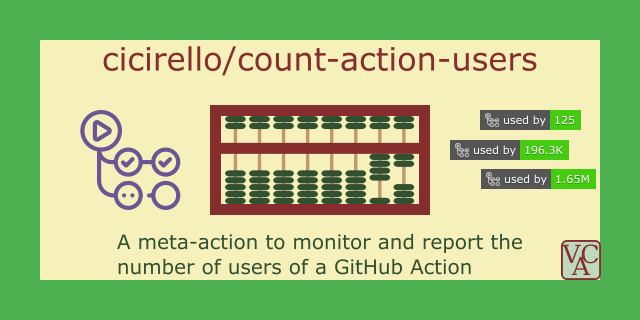

# count-action-users

[](#count-action-users)

Check out all of our GitHub Actions: https://actions.cicirello.org/

## About

[](https://github.com/marketplace/actions/count-action-users)
[](https://github.com/cicirello/count-action-users/actions/workflows/build.yml)
[](https://github.com/cicirello/count-action-users/actions/workflows/generate-samples.yml)
[](https://github.com/cicirello/count-action-users/actions/workflows/codeql-analysis.yml)
[](https://github.com/cicirello/count-action-users/blob/main/LICENSE)
[](https://github.com/cicirello/count-action-users)

The [cicirello/count-action-users](https://github.com/cicirello/count-action-users) GitHub Action 
generates a [Shields endpoint](https://shields.io/endpoint) with the count of the number of 
workflows that use a GitHub Action. It is thus a tool for
maintainers of GitHub Actions, and it can be used to insert a badge with a users count into the
README for a GitHub Action. The key features include:
* __Designed to Run on a Schedule__: The intended usage is to run the action on a 
  schedule (e.g., nightly) to update the endpoint. 
* __Customizable__: It is configurable in a number of ways (e.g., badge color, logo, style)
  using action inputs, but you can also override these things when you embed the badge using 
  Shield's URL parameters.
* __Multiple Action Support__: For those who maintain multiple GitHub Actions, the `count-action-users`
  action accepts a list of GitHub Actions as an input, generating endpoints for all actions 
  in the list. In this way, a single run of the action in a single workflow in a single repository
  is sufficient to regularly monitor the number of users of all of the actions that you maintain.
  Or, if you prefer, you can run the action separately within the repositories of each action.

_The developers of the `count-action-users` GitHub Action are not affiliated 
with the developers of Shields, although like most of GitHub we use their badges
in most of our repositories._

__Here are a Few Example Badges__
* Example with moderate number of users: 
  
* Example with very large number of users (`actions/setup-python`): 
  
* Example with huge number of users (`actions/checkout`): 
  

## Table of Contents

The remainder of the documentation is organized as follows:
* [Example Workflows](#example-workflows): Several example workflows illustrating 
  usage of the action.
* [FAQ](#faq): List of questions we anticipate you may have, or which have been asked.
* [Inputs](#inputs): Documentation of the action's inputs.
* [Outputs](#outputs): Documentation of the action's outputs.
* [All Possible Action Inputs](#all-possible-action-inputs): A workflow showing all
  of the action's inputs with their default values.
* [Support the Project](#support-the-project): The various ways that you can support
  the project.
* [License](#license): License information (MIT License).

## Example Workflows

### Example 1: Storing endpoint at root of repository

This first workflow runs on a schedule (daily at 4am), and it can also
be run manually if need be (via the `workflow_dispatch` event). It uses all
of the default action inputs. The default location for the generated endpoint
is the root of the repository. In this example, there is a single action that
we are monitoring: `owner/action-name`. The action names the endpoint file using
the name of the action, so in this case, the name of the file it creates is:
`action-name.json`. Please note that the `GITHUB_TOKEN` must be passed as an
environment variable, as shown in the workflow, to authenticate to the GitHub API.

```yml
name: count-action-users

on:
  schedule:
    - cron: '0 4 * * *'
  workflow_dispatch:

jobs:
  count:
    runs-on: ubuntu-latest
      
    steps:
    - uses: actions/checkout@v2

    - name: Generate user count JSON endpoint
      uses: cicirello/count-action-users@v1
      with:
        action-list: owner/action-name 
      env:
        GITHUB_TOKEN: ${{secrets.GITHUB_TOKEN}}
```

You can then pass the URL of the endpoint to Shields to generate and
insert a badge into your README with the following Markdown. Just be sure to
replace `OWNERUSERID`, `REPOSITORY`, and `BRANCH` as appropriate.

```markdown

```

Note that in the above, you are relying on GitHub's `raw.githubusercontent.com`
server for serving the endpoint to Shields. We do not actually recommend doing this
as that server isn't really intended for that purpose, and may create a delay
that will trickle down to Shields serving the badge. However, you might initially
set it up this way to try out the action. 
See [Example 2](#example-2-serving-via-github-pages-from-the-docs-directory) 
and [Example 3](#example-3-serving-via-github-pages-from-the-gh-pages-branch) 
for examples of our recommended approach, serving via GitHub Pages.

See [later in this document](#how-to-link-the-badge-to-search-results) for an 
example of the markdown needed to link the badge to a GitHub search results page
with the workflows represented by the user count. 

If you maintain more than one GitHub Action and want to generate
user count endpoints for all of them with a single application
of this action, then you can pass a list of your GitHub actions
as follows:

```yml
name: count-action-users

on:
  schedule:
    - cron: '0 4 * * *'
  workflow_dispatch:

jobs:
  count:
    runs-on: ubuntu-latest
      
    steps:
    - uses: actions/checkout@v2

    - name: Generate user count JSON endpoint
      uses: cicirello/count-action-users@v1
      with:
        action-list: >
          owner/action-one
          owner/action-two
          owner/action-three		  
      env:
        GITHUB_TOKEN: ${{secrets.GITHUB_TOKEN}}
```

The above example will generate the following JSON files:
`action-one.json`, `action-two.json`, and `action-three.json`.
Note that the `>` is one of the ways to specify a multiline string
in YAML.

### Example 2: Serving via GitHub Pages from the docs directory

The previous example relies on GitHub's `raw.githubusercontent.com`
server for serving the endpoint to Shields. This is less than ideal
as that server is intended for those browsing GitHub to see the
raw version of files, and isn't really intended for general serving
of files.

__GitHub Pages (our recommended approach)__: We instead recommend utilizing
GitHub Pages. The benefit of this is that you will gain the advantage of the 
CDN that backs GitHub Pages, thus significantly 
enhancing the speed of serving the endpoint to Shields. 
First note that you do not necessarily need to setup a full
website for this purpose. You can literally use it to serve nothing but
your user count JSON endpoint, if you don't want to otherwise set up a full project
page. Follow GitHub's directions for enabling [GitHub Pages](https://pages.github.com/)
on the repository in which you want to use the `count-action-users` action.

To do this, go to the settings tab of that repository, and then select "Pages" in the
left. In this example, we are assuming serving from the "docs" directory of your
default branch, so make those selections as you enable "Pages" for your repository.
Once you do, anything you store in the "docs" directory will be served
from the URL: `https://YOURUSERID.github.io/REPOSITORY/`.

So, now run the action using this workflow:

```yml
name: count-action-users

on:
  schedule:
    - cron: '0 4 * * *'
  workflow_dispatch:

jobs:
  count:
    runs-on: ubuntu-latest
      
    steps:
    - uses: actions/checkout@v2

    - name: Generate user count JSON endpoint
      uses: cicirello/count-action-users@v1
      with:
        target-directory: docs
        action-list: owner/action-name 
      env:
        GITHUB_TOKEN: ${{secrets.GITHUB_TOKEN}}
```

Note that the above workflow uses the 
`target-directory` input to store the endpoint in the docs directory,
which will be created by the action if it doesn't already exist.
Assuming that you have configured GitHub Pages to serve from "docs",
then your endpoint will be accessible from 
`https://YOURUSERID.github.io/REPOSITORY/action-name.json`.

You can then use the following Markdown to insert the badge in your README.
Just be sure to replace `YOURUSERID` and `REPOSITORY` as appropriate.

```markdown

```

If you are also utilizing GitHub Pages for a project site, then you might want
to store the endpoint in a subdirectory of "docs" to keep your site's files organized.
For example, perhaps you want to store it in a directory "endpoints", then you can
accomplish that with the following action input: `target-directory: docs/endpoints`.
This would change the necessary Markdown for inserting the badge to:

```markdown

```

See [later in this document](#how-to-link-the-badge-to-search-results) for an 
example of the markdown needed to link the badge to a GitHub search results page
with the workflows represented by the user count.

### Example 3: Serving via GitHub Pages from the gh-pages branch

GitHub Pages allows you to serve your site from either the "docs" directory
(as in the above example), or from the root of any branch. Assuming you are
setting this up in the repository of the action that you maintain, then the
default branch is not a good choice for your project site. Instead, create 
a `gh-pages` branch in your repository (you can then delete everything in the
`gh-pages` branch, as it only needs to contain the source of your project site).
Just like Example 2 above, you don't really need to have a project site, as your
site can literally be just the endpoint you want to pass to Shields.

Now, setup the following workflow in the default branch (e.g., "main") 
of your repository. Note that even though this workflow will be pushing to the `gh-pages` branch,
the workflow itself must be in the default branch, or else the schedule will not run.

```yml
name: count-action-users

on:
  schedule:
    - cron: '0 4 * * *'
  workflow_dispatch:

jobs:
  count:
    runs-on: ubuntu-latest
      
    steps:
    - uses: actions/checkout@v2
      with:
        ref: gh-pages

    - name: Generate user count JSON endpoint
      uses: cicirello/count-action-users@v1
      with:
        action-list: owner/action-name 
      env:
        GITHUB_TOKEN: ${{secrets.GITHUB_TOKEN}}
```

You'll notice above that the `count-action-users` step
did not change. Instead, the `checkout` step changed to
checkout the `gh-pages` branch of the repository. The
`count-action-users` action commits and pushes to the
checked out branch.

As in the previous example, the JSON endpoint will be at 
the root of the project site 
(`https://YOURUSERID.github.io/REPOSITORY/action-name.json`). Thus, you can then use the 
following Markdown to insert the badge in your README.
Just be sure to replace `YOURUSERID` and `REPOSITORY` as appropriate.

```markdown

```

If you'd rather have it in a subdirectory, you can set the appropriate action input,
such as with: `target-directory: endpoints`. Doing so would then require
the following Markdown for inserting the badge into the README:  

```markdown

```

See [later in this document](#how-to-link-the-badge-to-search-results) for an 
example of the markdown needed to link the badge to a GitHub search results page
with the workflows represented by the user count.

### Protected branches with required checks

The default permissions of the `GITHUB_TOKEN` are sufficient for pushing 
to a protected branch, provided that the branch protection hasn't been 
configured with required reviews nor with required checks. If the repository where
you are running the `count-action-users` action does have a branch protection 
rule with required reviews or required checks, there are a couple solutions.

__Not Recommended__: First, you could create a personal access token (PAT) 
with necessary permissions, save it as a repository secret, and use the PAT 
with during the actions/checkout step 
(see [actions/checkout](https://github.com/actions/checkout)'s documentation). 
However, we do not recommend doing so. If anyone else has write access to the 
repository, then they can potentially create additional workflows using that PAT
to bypass the required checks and/or reviews; and you obviously had a reason for
putting those requirements in place.

__Recommended__: Although your default branch likely has branch protection rules
that include required checks and/or reviews, you do not need to store your
user count endpoint in the default branch.
See [Example 3](#example-3-serving-via-github-pages-from-the-gh-pages-branch)
earlier, which uses the `gh-pages` branch along with GitHub Pages to serve the
endpoint to Shields. You can configure branch protection on the `gh-pages`
branch, and as long as you don't add any required checks or reviews for that
specific branch, the action will be able to push to it without the need for a PAT.

### Specific version vs major release

All of the above examples used the major release tag
for the `count-action-users` step 
(i.e., `uses: cicirello/count-action-users@v1`):

```yml
    - name: Generate user count JSON endpoint
      uses: cicirello/count-action-users@v1
      with:
        action-list: owner/action-name 
      env:
        GITHUB_TOKEN: ${{secrets.GITHUB_TOKEN}}
```

The advantage to this is that you will automatically
get all non-breaking changes and bug fixes without the
need to alter your workflow. If you prefer to 
use a specific release, just use the SemVer of the
release that you wish to use, such as with the following:

```yml
    - name: Generate user count JSON endpoint
      uses: cicirello/count-action-users@v1.0.2
      with:
        action-list: owner/action-name 
      env:
        GITHUB_TOKEN: ${{secrets.GITHUB_TOKEN}}
```

If you do use a specific release, then we recommend
configuring [GitHub's Dependabot](https://github.blog/2020-06-01-keep-all-your-packages-up-to-date-with-dependabot/)
in your repository.  Dependabot can be used to monitor dependencies,
including GitHub Actions, and generates automated pull requests to update
versions. The PRs it generates includes the text of release notes and ChangeLogs
giving you the opportunity to decide whether to upgrade the version.

### How to Link the Badge to Search Results

It is common practice to link status badges to something relevant
(e.g., a build status badge to workflow runs). For a users count badge,
you might consider linking it to a GitHub search results page. You can do that
with the following Markdown. Replace "YOURUSERID" with the user id of the owner
of the action, and replace "ACTIONNAME" with the name of the action. Also replace
"RELEVANT_SHIELDS_URL" with the link that generates the badge from the endpoint
(see the examples in the workflow examples above).

```markdown
[](https://github.com/search?q=YOURUSERID+ACTIONNAME+path:.github/workflows+language:YAML&type=Code)
```

